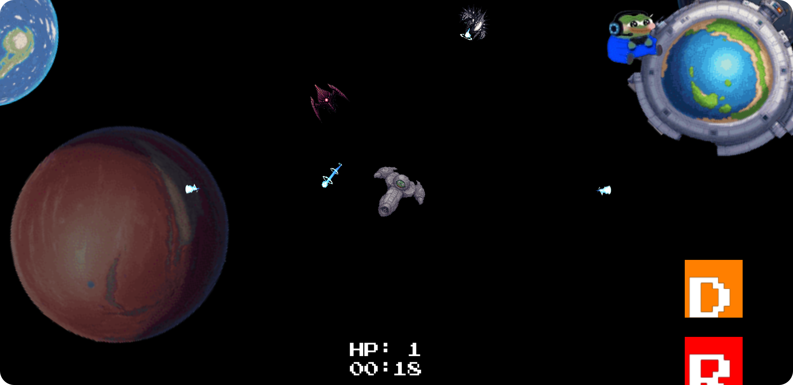
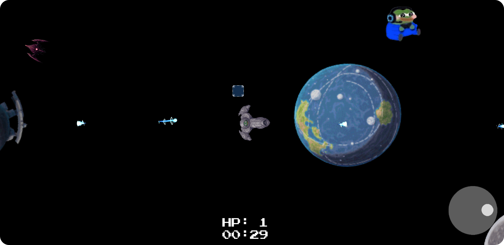

# Cosmic Survivors - 

A modern Android space shooter game built with OpenGL ES 3.0, featuring dynamic gameplay mechanics, item pickups, and procedural enemy spawning.

## Screenshots
  

## Features

### Core Game Mechanics
- Real-time 2D space combat using OpenGL ES 3.0
- Dynamic player movement with virtual joystick controls
- Procedurally generated enemy spawning system
- Multiple enemy types with unique behaviors:
    - Stalker: Aggressively pursues the player
    - Sniper: Maintains distance while shooting projectiles
- Health system with player lives and damage mechanics
- Score tracking system

### Graphics & Visual Effects
- Custom OpenGL ES 3.0 rendering pipeline
- Hardware-accelerated 2D graphics
- Sprite-based animation system
- Dynamic parallax scrolling background with planets
- Particle effects for explosions and projectiles
- Smooth rotation and movement interpolation
- Custom shader implementation for textures and effects

### Item & Power-up System
- Multiple collectable power-ups:
    - Laser Canon: Basic rapid-fire weapon
    - Laser Beam: Powerful directional beam attack
    - Rocket Launcher: Homing missile system
    - Shield: Temporary damage protection
    - Jetpack: Movement speed boost
- Visual item pickup notifications
- Inventory management system

### Technical Features
- Entity Component System (ECS)-inspired architecture
- Efficient batch rendering system
- Custom texture atlas implementation
- Advanced collision detection using Separating Axis Theorem (SAT)
- Memory-efficient vertex buffer management
- Robust audio system for sound effects and music
- Frame-independent physics calculations

### UI/UX Features
- Dynamic touch controls with virtual joystick
- Pause menu system
- Score and time display
- Health indicator
- Game over screen
- Item pickup notifications
- Smooth transitions and animations

## Technical Implementation

### Graphics Engine
- Custom OpenGL ES 3.0 renderer
- Vertex Buffer Object (VBO) management
- Texture atlas for efficient sprite rendering
- Custom shader programs for different rendering modes:
    - Regular textures
    - Color overlays
    - Solid colors
    - Transparency handling

### Core Systems
- Game Loop Management:
    - Fixed timestep updates
    - Frame-independent physics
    - Efficient entity management
- Collision System:
    - Separating Axis Theorem (SAT) implementation
    - Dynamic collision response
    - Efficient broad-phase collision detection
- Audio System:
    - Sound effect management
    - Background music handling
    - Audio state management

### Entity Management
- Hierarchical entity system
- Component-based actor system
- Efficient entity pooling
- Dynamic entity spawning and cleanup

### Input Handling
- Multi-touch support
- Virtual joystick implementation
- UI interaction system
- Gesture recognition

### Performance Optimizations
- Batch rendering system
- Efficient vertex buffer management
- Object pooling for frequently created entities
- Smart entity culling when out of bounds
- Memory-efficient texture management

## Project Structure

The project follows a clean architecture pattern with clear separation of concerns:

- `core/`: Core game systems and management
- `entities/`: Entity implementations and behaviors
- `graphics/`: OpenGL rendering and shader management
- `sound/`: Audio system implementation
- `utils/`: Utility classes and helper functions

## Technical Requirements

- Android 4.4+ (API Level 19)
- OpenGL ES 3.0 capable device
- Minimum 2GB RAM recommended
- Touch screen support

## Building and Running

1. Clone the repository
2. Open in Android Studio
3. Build and run on the emulator or compatible Android device

## Development Best Practices

The project follows several key development practices:

- Clean Code principles
- Efficient memory management
- Frame-independent physics
- Efficient batch rendering
- Component-based architecture
- Robust error handling

## Future Enhancements

Planned features for future releases:

- Additional enemy types
- More power-ups and weapons
- Progression system
- Achievements
- Local high scores
- Additional visual effects
- More sound effects and music

## Credits
- [List of used assets](/Assets/Assets.md)
